# Image Classification - STL10
***
### 目的:
##### 圖片分類 ( Image Classification ) 是個重要且基礎的機器學習主題之一，幾乎所有的應用最終都會需要用到 “分類” 功能，這邊簡單介紹一下使用一些簡單的架構來對學術上的 基準( benchmark )資料集 做分類分析，看看不同模型 backbone 的學習效果。
***
### 資料集 ( DataSet )
* 名稱: STL10
* 圖片尺寸: 96 x 96
* 物件種類數量: 10
* 物件: 飛機, 鳥, 汽車, 貓, 鹿, 狗, 馬, 猴子, 船, 卡車
* 圖片數量: 5000 (train) / 8000 (test)
* 來源: https://cs.stanford.edu/~acoates/stl10/

***
### 模型 ( Model Backbones )
* EfficientNet_b0
* ResNet18
* ResNet50
* SE-Resnext50
##### 基於運算資源有限，所以這邊僅以 ResNet 相關模型為主，並輔以一個差不多等級的 EfficientNet_b0 來比較結果。Backbone 後面直接串接一個輸出為10的線性模組當作分類器，輸出結果再加上softmax()使其10個預測值呈現0~100%之間的機率分布(總合為100%)。
***
### 資料增強 ( Data Augmentation )
##### 為增強資料集的廣泛性與避免訓練 過擬化( over-fit )，訓練上都有隨機加上包括 Transpose, HorizontalFlip, VerticalFlip, ShiftScaleRotate, CoarseDropout, HueSaturationValue 等等變化及正規化 (Normalize)。其中 CoarseDropout 是近一兩年流行的，可以隨機將圖片中某些區塊值用特定值取代，反之隨機將某些 channel 拋棄的 dropout 近期倒是比較少見了。
***
### 訓練 ( Train, transfer learning)
##### 這邊不使用從零開始( from scratch) 的訓練方式，而是直接載入預先訓練好的 (pretrained) 模型作遷移學習(transfer learning)，站在巨人的肩膀上學習效果會好很多，另外一篇 (Cifar100) 文章我會做兩者的效果比較。
### Image size: 96x96
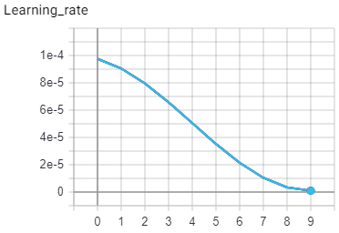
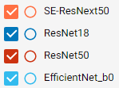
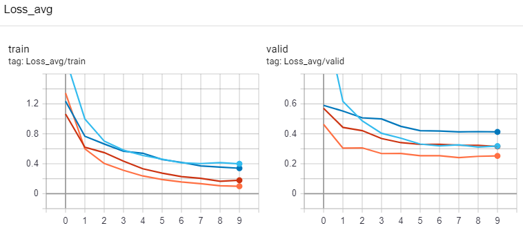
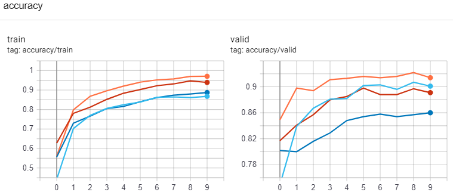
***
### Image size: 192x192

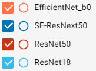
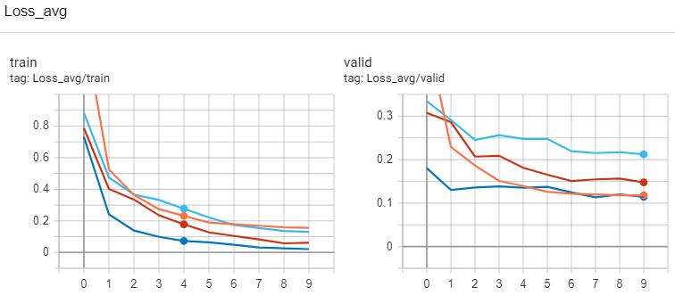
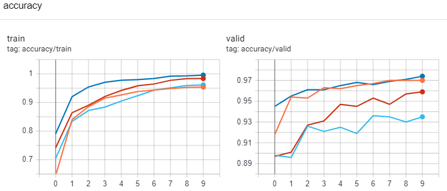
##### 不管是 96x96 或是 192x192 的訓練結果，從 loss 圖(尤其是valid) 看的出來訓練還沒到 過擬合，主要也是因為訓練次數(epochs)只有10次，這種以 微調 (fine-tune) 的訓練大概10次左右可以看到不錯的效果，不過不同資料集還是有不同差異，實際上還是要跑過才知道。
***
### K-Fold 資料分拆訓練
##### 下面則是做五次資料分拆的訓練結果:  

* Image size: 96x96, Model: EfficientNet_b0
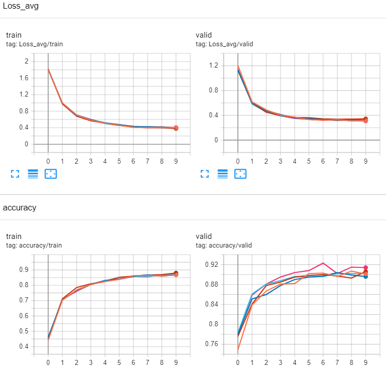  

* Image size: 96x96, Model: ResNet18
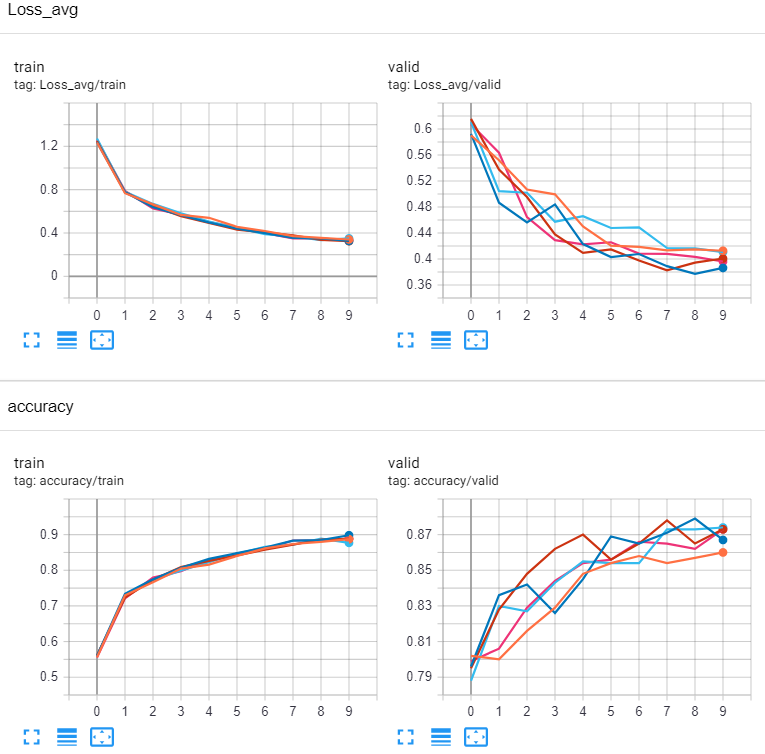  

* Image size: 96x96, Model: ResNet50
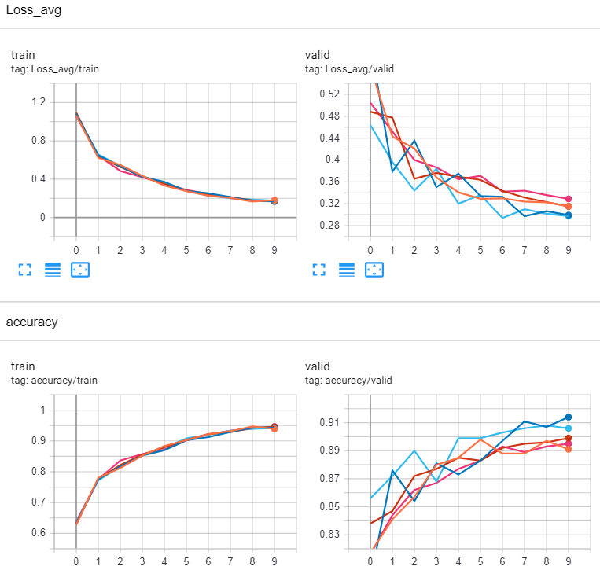  

* Image size: 96x96, Model: SE-ResNext50
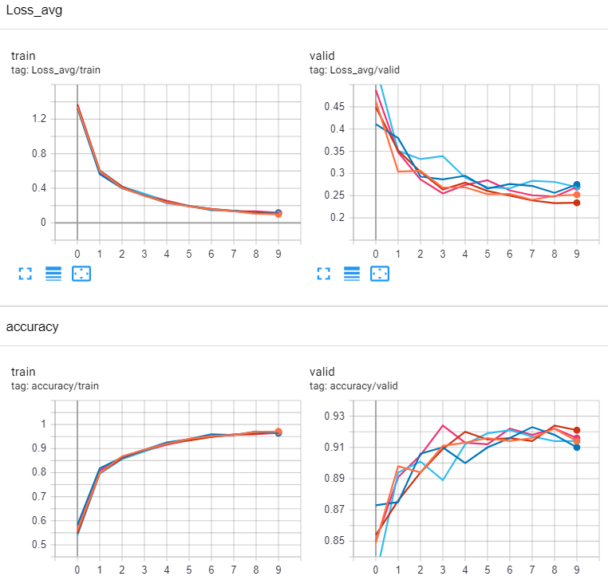
***
* Image size: 192x192, Model: EfficientNet_b0
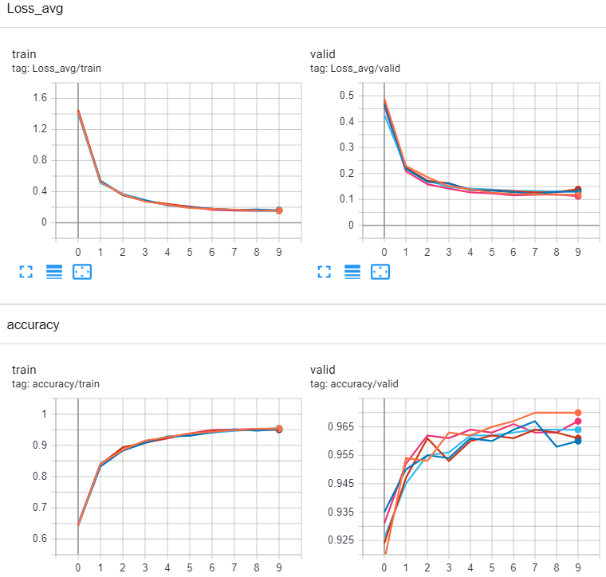  

* Image size: 192x192, Model: ResNet18
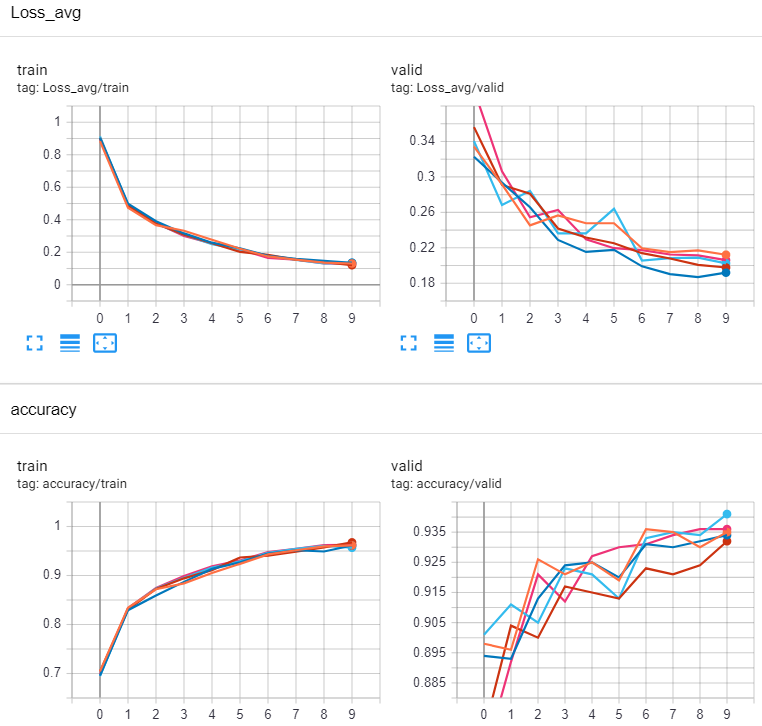  

* Image size: 192x192, Model: ResNet50
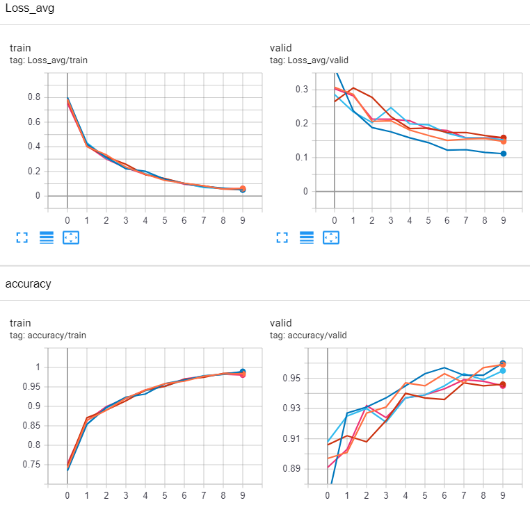  

* Image size: 192x192, Model: SE-ResNext50
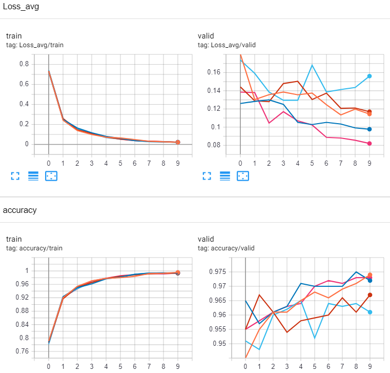  

##### 雖然 SE-ResNext50 看起來似乎抖動很嚴重，但其實那是因為y軸刻度範圍較小的緣故。
***
### 測試 ( Test )
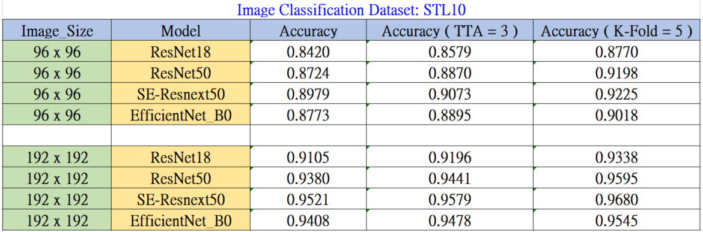  
##### 原始的圖片尺寸為 96x96 ，因為經過 backbone stride=32 的特徵提取後，只剩下 3x3 的 輸出，不見得撐得起最後的線性模組，所以測試上我多加上向上內插2倍到 192x192 的圖片做測試，而的確結果遠勝原始的 96x96 小圖片。雖然圖片可以無止盡往上加大，但是效果會越來越小，一來畢竟是內插值，二來是模型的極限，另外則是資料集的可分辨性、正確性、分布、數量等等關鍵因素會嚴重影響準確度。  
##### 由此表大概可以看的出來，SE-Resnext50 的效果最好，達到了96.8%的精確度，和學術上發表的論文結果接近，而EfficientNet_b0 比起 ResNet50 雖然模型參數數量上比較少，但是在此處的準確度卻是稍微更佳一些。另外，加上 TTA (Test Time Augmentation) 有助於增加精確度，當然效果最好的還是用 K-fold 做資料拆分作多次訓練與測試。如果時間上與機器上更多的話，K-fold + TTA 搭配運用應該能讓準確度再上升一些，甚至用上更大型的模型應該能達到更不錯的結果。  
#### 歷代學術論文結果:
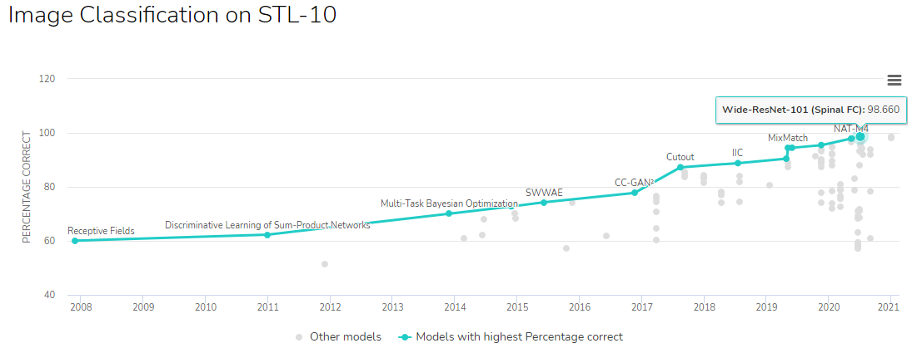  
***
### 結論
##### STL10 的圖片也是早期常用的的基準資料集，物件種類10偏少，圖片尺寸上也偏小，但是資料完整，各種種類都各有500張(train)/800張(test)，沒有資料不平衡的問題，所以訓練上可以達到非常高的準確度，用來了解分類器模型的訓練趨勢是非常不錯的。
